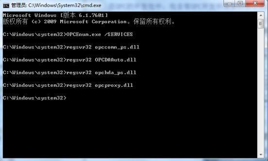
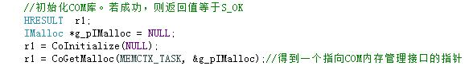
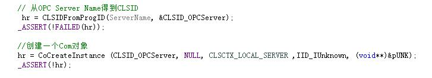
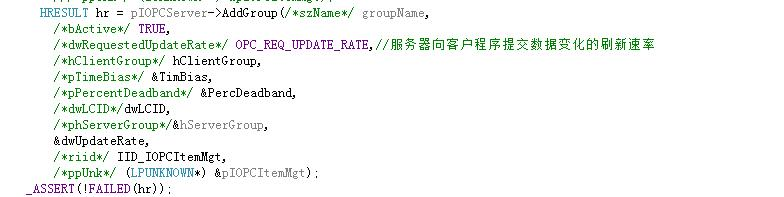
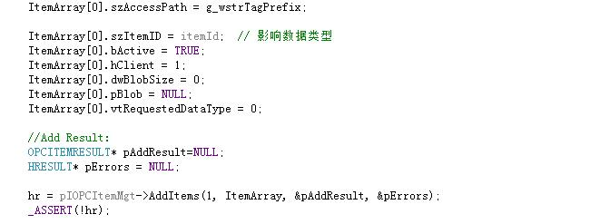
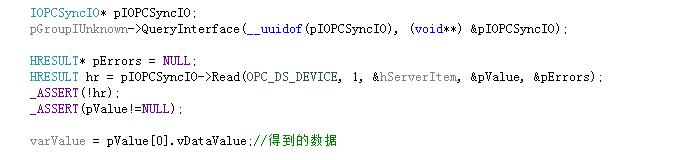

* content
{:toc}

主要介绍c++语言利用OPC标准库文件与组态王通讯的几个关键步骤，具体代码会在[我的github](https://github.com/neuzhaoxin/c-plus-opc-communication)中贴出来。

## 1、环境配置
将opccomn_ps.dll,PCDAAuto.dll,OpcEnum.exe,opchda_ps.dll,opcproxy.dll这五项全部复制到“C：\Windows\System32”目录下，然后进行注册。

## 2、核心程序

### 头文件

需要在头文件中包含OPC标准库文件
"Opcda_i.c"，
"Opcda.h"，
"Opccomn_i.c"，
"Opccomn.h"

### 初始化COM库并连接OPC服务器

### 创建OPC组

### 添加Items

### 读取数据

### 写入数据

注：转载请注明，来自https://neuzhaoxin.github.io